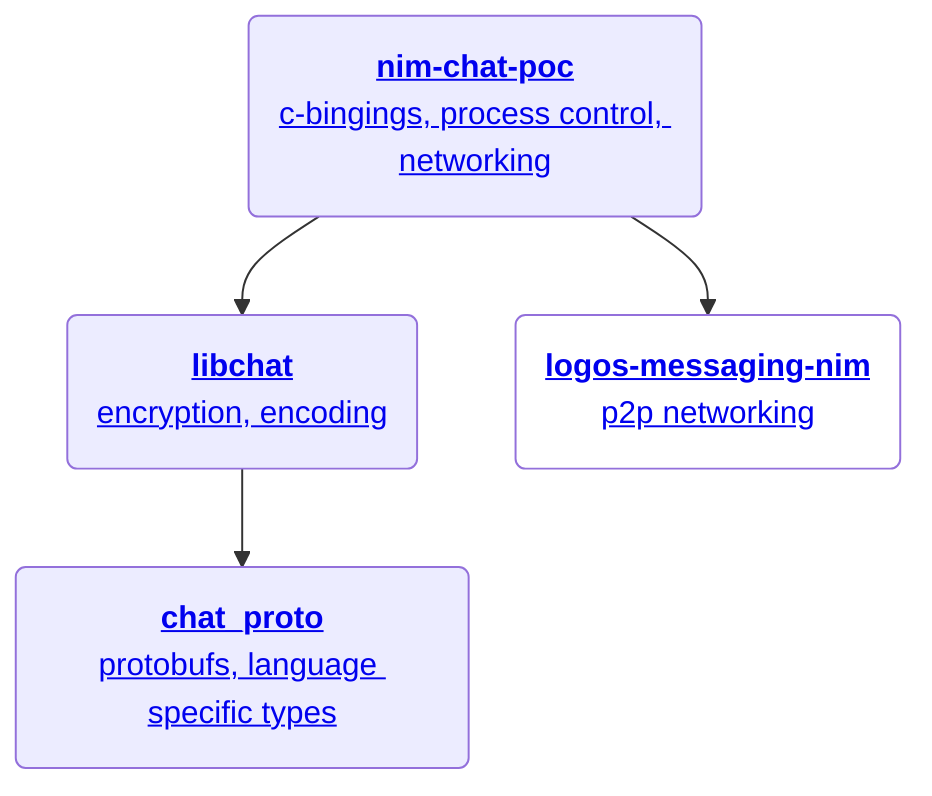

# Developer Guide

## Repository Map

## Repositories

### nim-chat-poc
Root of the Logos chat SDK, written in Nim.

Handles async operations and bridges network operations with the cryptographic backend.

**Responsibilities:**
- C bindings to libchat
- Async execution (Chronos)
- Network integration

### libchat
Cryptographic logic implementation in Rust.

Operates as a pipeline: accepts either encrypted payloads or plaintext content, returns the other. Encrypted payloads can be sent directly to network clients; decrypted content goes to applications.

**Responsibilities:**
- Cryptographic implementations
- Encoding/decoding

### logos-messaging-nim
P2P networking layer using logos-messaging protocol.

Provides decentralized message transport. This is an external dependency.

### chat_proto
Protobuf definitions.

Defines the protobufs used in the logos-chat protocol and provides generated types for various languages.