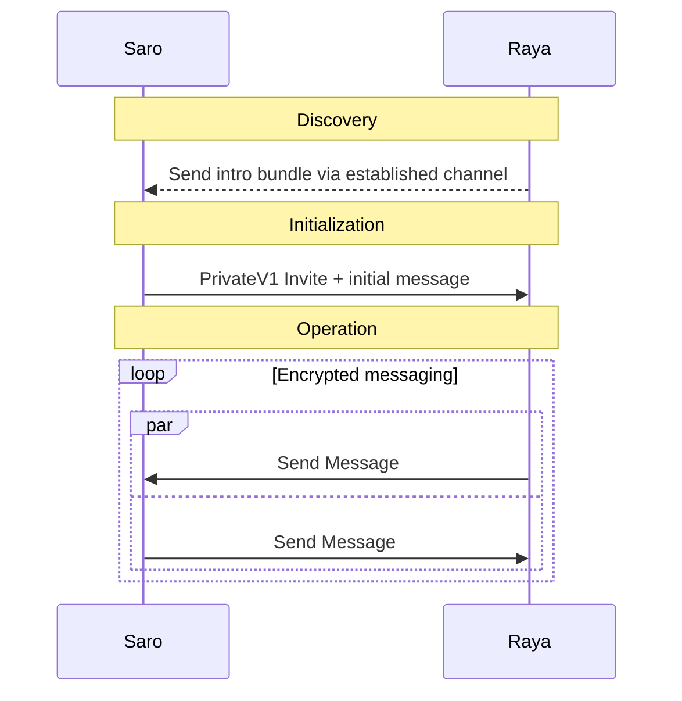

# Logos Chat Nim

[](https://github.com/logos-messaging/logos-chat/actions/workflows/ci.yml)


A privacy focused decentralized messaging SDK, built on the Logos Stack. Logos Chat provides permission-less, censorship-resistant communication for humans and clankers.


## Quick Start

### Prerequisites

- [Nim](https://nim-lang.org/) >= 2.2.4
- [Rust](https://www.rust-lang.org/tools/install) (for libchat cryptographic backend)
- Make

### Build

```bash
# Initialize submodules and dependencies
make update

# Build all targets (examples + shared library)
make all

# Run tests
make tests
```


### Quick Tasks

Here are common tasks to get up and running. See [`examples/`](examples/) for full examples, including [`pingpong.nim`](examples/pingpong.nim) which demonstrates a full two-client conversation.


**Initialize Client** 

```nim
let waku = initWakuClient(DefaultConfig())
var client = newClient(waku).get()
...
...
client.start()
```

**Create Introduction Bundle**

Introductions are single use key-bundles required by Senders to initiate a conversation.
Recipients must generate them before anyone can contact them. 
IntroBundles contain no secrets and can be published, or transmitted over over other channels.  

```nim
...
# IntroBundles are sent to other clients Out-of-Band to establish a conversation. 
let intro_bundle = client.createIntroBundle()
...
```
**Create 1:1 Chat**

Once a Sender has retrieved a bundle then they can create a conversation. 
All conversations must have an initial message. 
```nim
...
let initial_content = @[1,2,3]

# This intro_bundle must come from another client
let convo_id = await client.newPrivateConversation( intro_bundle, initial_content )
...
```

**Receive Message**

Receiving a message is accomplished by registering a callback. 
```nim
...
client.onNewMessage(proc( convo: Conversation, msg: ReceivedMessage ) {.async.} =
    echo convo.id(), msg.content

)
...
```

**Send Message**

```nim
...
let content =  @[1,2,3]
let convo = client.getConversation( convo_id )
await client.sendMessage( content )
...
```

## Message Flow



### C Bindings

A shared library with C bindings is available:

```bash
make liblogoschat
```

This produces `build/liblogoschat.{dylib,so,dll}`. See [`library/liblogoschat.h`](library/liblogoschat.h) and [`examples/cbindings/`](examples/cbindings/) for usage.


## License

Dual-licensed under [MIT](LICENSE-MIT) and [Apache 2.0](LICENSE-APACHE).
