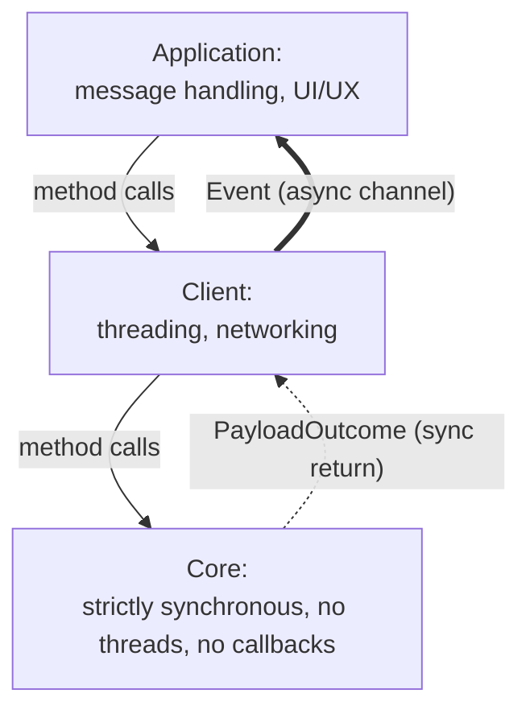

# logos-chat

[](https://github.com/logos-messaging/logos-chat/actions/workflows/ci.yml)


λChat is an authenticated communication protocol for chat-like use-cases - with a focus on privacy and censorship-resistance.

Applications can connect and converse in a handful of calls: open a client,
start a group, send, and read the events that come back.

> **Status: pre-1.0, and moving.** Every crate is `0.1.0`, the protocol is not
> frozen. This project is under active development, and some breaking changes are expected.

---

## Building

Most of the workspace is plain Cargo:

```sh
cargo build          # default members: core + generic client
cargo test
```

`logos-chat` and `chat-cli` link the native `liblogosdelivery`, so they sit
outside the default members. The Nix dev shell builds it and exports
`LOGOS_DELIVERY_LIB_DIR`:

```sh
nix develop
cargo build -p logos-chat
```

## Testing

```sh
nix develop    # the workspace-wide recipes link the native library
just check     # tests + clippy across the workspace, warnings denied
just test
just clippy
```

## Use it as a library

There are two entry points, and which one you want depends on how much you want
to decide.

### `logos-chat` — the opinionated stack

One call commits to the whole Logos service stack: an embedded logos-delivery
node as the transport, the Logos keypackage + account registry, an installation
identity, and SQLCipher-encrypted storage on disk. Independently built clients
that call `open` are interoperable by construction.

```rust
use logos_chat::{DbKey, GroupMetadata, LogosConfig, open};

// The 32 bytes the database is encrypted with. Deriving them from a passphrase, or reading
// them out of the OS keychain, is the application's — the library runs no derivation.
let config = LogosConfig::new("/path/to/chat.db", DbKey::from(db_key_bytes));
let (mut client, events) = open(config)?;

println!("my address: {}", client.addr());

// A group, and someone to put in it.
let convo = client.create_group_conversation(
    &[&peer_account],
    GroupMetadata::new("weekend", "trip planning"),
)?;
client.send_message(&convo, b"who's driving?")?;
```

`LogosConfig` requires only a database path and key; the registry endpoint, the
embedded node's p2p settings and group timing all default.

### `logos-generic-chat` — bring your own everything

The same `ChatClient`, with the transport, registry and store as type
parameters. Nothing about Logos is baked in; implement `Transport` over your own
network and the client works unchanged.

```rust
use logos_generic_chat::{ChatClientBuilder, PendingInstallation, StorageConfig};

let pending = PendingInstallation::generate();
// ... the account endorses `pending.endorsement_request()` ...
let installation = pending.complete(account_addr);

// `build` fails unless `my_auth` confirms the endorsement.
let (mut client, events) = ChatClientBuilder::new(installation)
    .transport(my_transport)      // any `Transport` impl
    .registration(my_registry)    // any `RegistrationService`
    .auth(my_auth)                // any `AuthService`
    .storage_config(StorageConfig::Encrypted { path, key })
    .build()?;
```


## Architecture

Three layers, calls flowing down, events flowing up:


```mermaid
flowchart TB
    A["Application:<br>message handling, UI/UX"]
    B["Client:<br>threading, networking"]
    C["Core:<br>strictly synchronous, no threads, no callbacks"]

    A -- "method calls" --> B
    B -- "method calls" --> C
    C -.->|"PayloadOutcome (sync return)"| B
    B == "Event (async channel)" ==> A
```

The core mentions no threads and starts no work of its own; everything external
reaches it as an injected service.

## Repository map

```
account/       account identity, shared with the rest of Logos
  account-log/     append-only signed account log: entries, invariants, encoding
  account/         crate `account`: accounts and the resolver over published logs

core/          protocol and storage components. All code is synchronous.
  conversations/   crate `libchat`: the synchronous core, conversation types, causal history
  crypto/          key types, HKDF, XEdDSA
  storage/         store traits
  sqlite/          SQLCipher-backed store
  integration_tests_core/  multi-client test harness

crates/        the client layer
  generic-chat/    crate `logos-generic-chat`: ChatClient, builder, events — transport-agnostic
  logos-chat/      the opinionated Logos stack chat client.

extensions/    pluggable implementations
  components/          registries, delivery helpers, wakeup
  logos-delivery-rust/ FFI bindings to liblogosdelivery
  embedded-logos-delivery/  an embedded Waku node as a Transport
  message-store/       an application's chat messages in its own SQLite database

bin/chat-cli/  example terminal chat app
docs/adr/      architecture decision records
```


## License

Dual-licensed under either [MIT](LICENSE-MIT) or [Apache 2.0](LICENSE-APACHE),
at your option.
