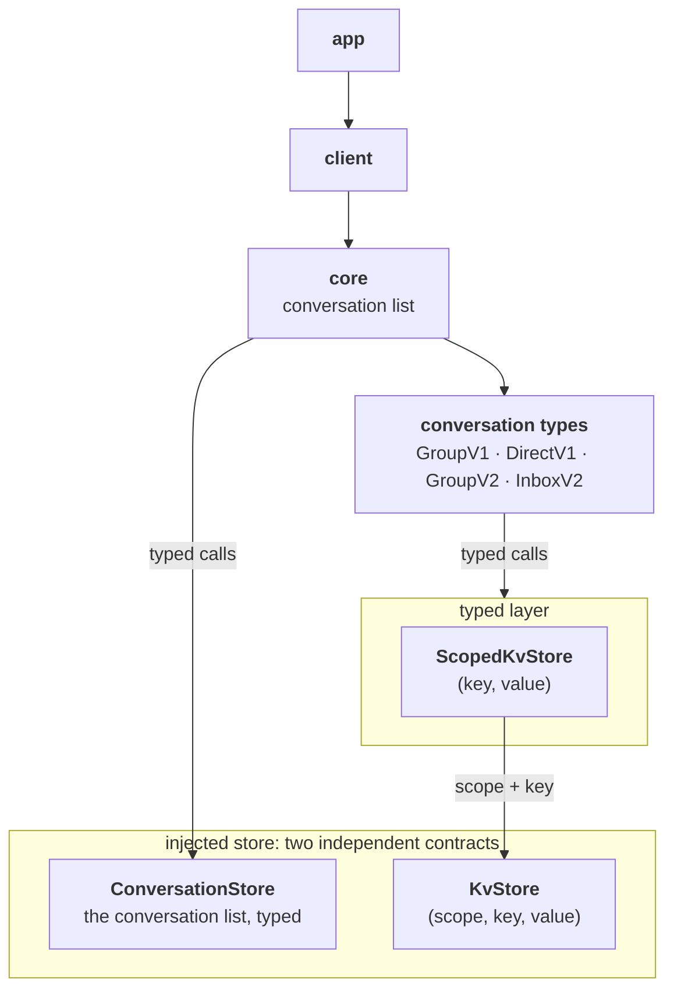

# Storage Architecture

| Field | Value |
|---|---|
| Status | Accepted |
| Issue | https://github.com/logos-messaging/libchat/issues/112 |
| Discussion | https://github.com/logos-messaging/libchat/discussions/218 |
| Date | 2026-08-25 |
| Last revised | 2026-09-15 |

## Context and Problem

Conversation types are the unit of change in libchat and the expected cadence is high, plausibly a new type every few weeks. Each arrives with storage requirements of its own: GroupV2 brings peer scores, a consensus signer key, `app_id`, pending invites, and its config on top of MLS group state. Whenever such requirements reach the store contract, a release breaks every store implemented outside this repo and hands each author a migration for state they do not own.

Issue #112 is the trigger: MLS group state lives in an in-memory `MemoryStorage`, so no conversation survives a restart. The question it forces is not how to persist MLS, but where a type's schema lives, so that shipping one stays a libchat-only change.

## Decision Drivers

- **A new type must not move the boundary:** no trait change, no DDL, nothing to do for a store written a year earlier.
- **State is scoped to the protocol that produced it and the conversation it belongs to,** so sandboxing one, purging one, or retiring one is mechanical.

## Architecture

The app builds one store and hands it to the client, which passes it to the core. The store carries two independent contracts: a `KvStore` substrate for everything a conversation type owns, and typed contracts for everything else, today `ConversationStore`, the core's conversation list. Local identity storage is outside this ADR.

The line between them follows how often the state changes shape. Conversation types arrive every few weeks, so what they own goes through the substrate, where a new type changes no contract. Everything else changes rarely, so it gets a typed contract a store can index and query: `ConversationStore` is the first, and state of that kind libchat persists later gets a typed contract beside it. A typed contract is not a schema mandate, so a store may back it with rows or with its own key-value layout.

A conversation gets a `ScopedKvStore`, the substrate's verbs with its own scope already bound; a type keeps its typed accessors and its adapters for foreign storage traits in one module, the typed layer in the diagram.



## Decisions

1. **The injected substrate addresses bytes by scope, inside a transaction.** A scope is the namespace of the owner plus the instance the value belongs to, a conversation for a conversation protocol, and every verb takes it. `begin()` opens the transaction the verbs live in, one at a time; `commit` lands it and a drop discards it. Nothing swaps transaction types at runtime, so the box `begin` returns is not polymorphism: it keeps the store's transaction type out of the types above it, so libchat's transaction, the scope handle and the MLS provider carry a lifetime and no store parameter. The price is one allocation per transaction and a virtual call per verb; an associated type moves that price onto every one of those types instead. Neither contract knows about the other.

    ```rust
    /// Where a value lives: the namespace of its owner, and the instance of that owner the value belongs to.
    struct Scope<'a> { ns: Namespace, instance: &'a str }

    trait KvStore {
        /// Opens a transaction; a second one while it is open is an error.
        fn begin(&self) -> Result<Box<dyn KvTx + '_>, StorageError>;
    }

    /// The verbs take `&self`: several scopes over one transaction are alive at once, and OpenMLS
    /// writes through `&self`, so a store mutates through interior mutability.
    trait KvTx {
        fn get(&self, scope: &Scope, key: &[u8]) -> Result<Option<Vec<u8>>, StorageError>;
        fn put(&self, scope: &Scope, key: &[u8], value: &[u8]) -> Result<(), StorageError>;
        fn delete(&self, scope: &Scope, key: &[u8]) -> Result<(), StorageError>;
        fn scan_prefix(&self, scope: &Scope, prefix: &[u8]) -> Result<Vec<(Vec<u8>, Vec<u8>)>, StorageError>;
        fn delete_prefix(&self, scope: &Scope, prefix: &[u8]) -> Result<(), StorageError>;

        /// Empties one scope, which is how a conversation is removed.
        fn delete_scope(&self, scope: &Scope) -> Result<(), StorageError>;

        /// Drops every scope under a namespace, its conversations included.
        fn delete_namespace(&self, ns: Namespace) -> Result<(), StorageError>;

        /// Lands the transaction; reads inside see its own writes, and a drop without commit discards them.
        fn commit(self: Box<Self>) -> Result<(), StorageError>;
    }
    ```

2. **A namespace is the conversation kind that owns the state, as a closed enum in the store contract:** `ConversationKind::{GroupV1, DirectV1, GroupV2}`, gaining a variant when a conversation type ships; the substrate stores it as an opaque `Namespace` name and never enumerates it. Uniqueness becomes a property of the type rather than a convention, kind names already carry their version, and retiring one is `delete_namespace`. A conversation's record carries the same kind, so one enum both lists a conversation and files its state; InboxV2 keeps its key packages outside any conversation and files them under a namespace of its own.

3. **A conversation addresses storage through a `ScopedKvStore` handed to it, never through the substrate.** A `ScopedKvStore` is the key verbs with one scope already bound (`tx.scope(ns, convo_id)` builds it), so a type composes whatever key layout it wants inside its scope and can name neither another protocol's state nor a sibling conversation's. Scopes are per operation: the entry point opens the transaction, the scope over it is built wherever the conversation's identity is already known, and a conversation receives a fresh one per call, so a write outside the open unit is unrepresentable. `ServiceContext` does not carry the substrate; another type's state is reachable only through a typed handle to it, such as `KeyPackages`.

    ```rust
    // core.rs, build_convo: the one site that turns the kind a record names into its conversation type
    let kv = tx.scope(kind, convo_id);
    let convo = match kind {
        ConversationKind::GroupV1 => {
            ConvoTypeOwned::Group(Box::new(GroupV1Convo::load(cx, kv, convo_id.to_string())?))
        }
        ConversationKind::DirectV1 => {
            ConvoTypeOwned::Direct(Box::new(DirectV1Convo::load(cx, kv, convo_id.to_string())?))
        }
        // GroupV2 state is durable, but de-mls offers no way to resume a conversation from it yet
        ConversationKind::GroupV2 => {
            return Err(ChatError::UnsupportedConvoType(kind.as_str().into()));
        }
    };
    Ok(ScopedConvo { kind, convo })

    // conversation/group_v1.rs, load: the type shapes every key inside its own scope
    let group_id = Self::group_id_for(&convo_id)?;
    let mls_group = MlsGroup::load(&MlsAdapter::Convo(kv), &group_id)?
        .ok_or_else(|| ChatError::NoConvo("mls group not found".into()))?;
    ```

    Conversation logic never composes a key inline; keys stay behind the type's accessors. Isolation runs in both directions and neither rests on a type shaping its keys correctly: a protocol cannot read its neighbour's state, and a conversation cannot read its sibling's.
4. **Code shared between types is written once and constructed with the owner's scope.** A component several types reuse takes its `ScopedKvStore` at construction, so one implementation lands state in whichever scope owns the conversation. The MLS `StorageProvider` adapter is today's case: GroupV1 and GroupV2 groups get identical key shapes from the same code and still land in separate scopes. The conversation is the scope, so it is one handle to load through and one call to purge.

    ```
    (GroupV1, <convo_id>)   mls/tree, mls/context, mls/epoch/<epoch>/<leaf>/enc_keys
    (GroupV2, <convo_id>)   mls/...                 same shapes, same code, separate scope
                            config, peer_scores/<ident>
    (InboxV2, <signer id>)  key_package/<hash_ref>  minted once, consumed on Welcome
    ```

    A cross-type entry stays single-copy with the type that mints it, offered to the rest as a service, never as a scope. Today that is the key package: InboxV2 mints it, a Welcome for a group of any type consumes it unless it is last resort, and `KeyPackages`, which InboxV2 builds on the open transaction over the scope it binds for its signer, is that service, where state a protocol owns outside any conversation lives.

    An adapter for a foreign trait that spans both takes each destination at construction and routes per method, not per instance:

    ```rust
    enum MlsAdapter<'a> {
        Convo(ScopedKvStore<'a>),                  // a group operation, in this conversation's scope
        KeyPackages(KeyPackages<'a>),              // before a conversation exists, the scope InboxV2 binds
        Join(ScopedKvStore<'a>, KeyPackages<'a>),  // a join, which reads a key package and writes the group at once
    }
    ```

    | `StorageProvider` methods | Destination |
    |---|---|
    | 3 key package | the shared service |
    | every other | the conversation's scope |
5. **Each mutating core entry point runs in one transaction, and nothing is published before it commits,** so a crash loses at worst an unsent message, never sent-but-forgotten state.

    ```rust
    // core.rs, the shape every mutating entry point follows
    let tx = KvTransaction::begin(&self.store)?;
    let outcome = operation(&mut self.services, &tx); // writes land in tx, published frames are held
    Self::commit(&mut self.services, tx, outcome)?;   // commits, or drops the writes and the frames together
    self.record(kind, &convo_id)?;                    // a new conversation's record, after the commit
    self.publish()?;                                  // only now does a frame reach the wire
    ```

    Conversations publish through a delivery service that holds every frame until the core releases it, so the order does not rest on each type remembering it. One transaction spans scopes, so a join that reads InboxV2's key package and writes the group into its own scope lands whole or not at all. The record in `ConversationStore` cannot join the transaction, so it is written after the commit and deleted before the scope: a crash in between leaves state no record lists, which a purge can sweep, never a record without state.

6. **App features are the app's concern.** libchat persists the state it owns; whatever the app builds on top of the client, the app stores.

## Consequences

Shipping a conversation type is a namespace variant plus the type's own storage module, all inside libchat. The price is that type-owned state is opaque to the store: listing is scan-and-decode, inspection sees blobs, and schema discipline moves into serialization conventions. What a store does see is the address, so it can index or partition by conversation without knowing what a single key means.

`ConversationStore` changes remain breaking for stores, and that is the bet: types keep arriving, while a conversation list is close to complete. If the bet proves wrong, folding the list into a namespace converges this design onto a pure substrate.

