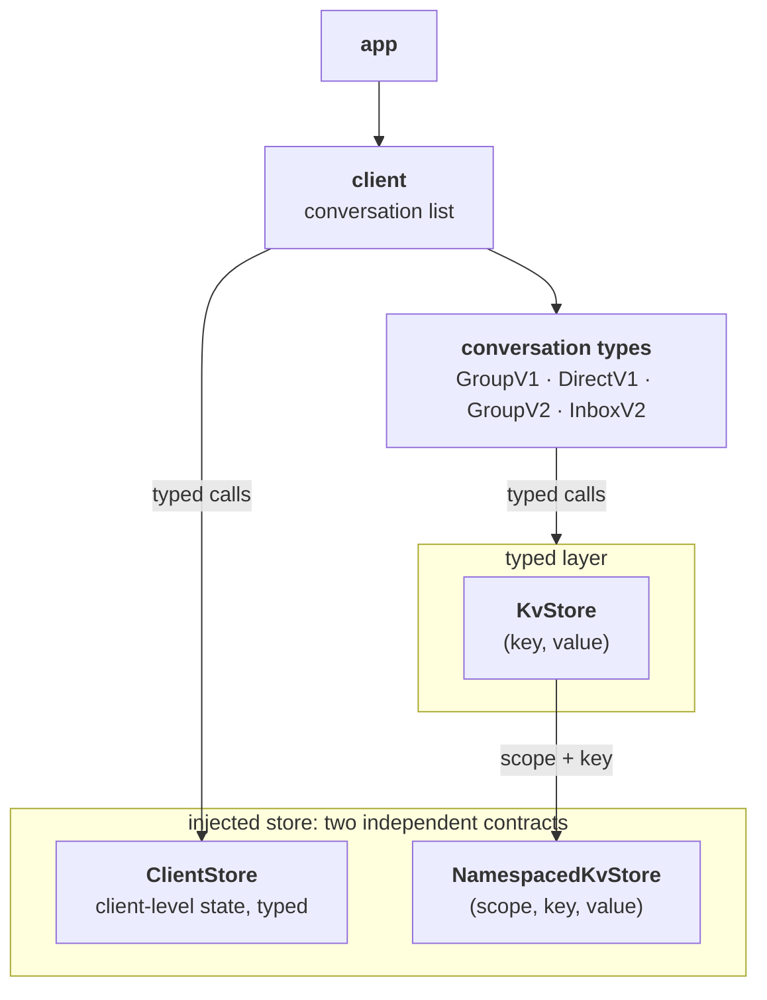

# Storage Architecture

| Field | Value |
|---|---|
| Status | Proposed |
| Issue | https://github.com/logos-messaging/libchat/issues/112 |
| Discussion | https://github.com/logos-messaging/libchat/discussions/218 |
| Date | 2026-08-25 |

## Context and Problem

Conversation types are the unit of change in libchat and the expected cadence is high, plausibly a new type every few weeks. Each arrives with storage requirements of its own: GroupV2 brings peer scores, a consensus signer key, `app_id`, pending invites, and its config on top of MLS group state. Whenever such requirements reach the store contract, a release breaks every store implemented outside this repo and hands each author a migration for state they do not own.

Issue #112 is the trigger: MLS group state lives in an in-memory `MemoryStorage`, so no conversation survives a restart. The question it forces is not how to persist MLS, but where a type's schema lives, so that shipping one stays a libchat-only change.

## Decision Drivers

- **A new type must not move the boundary:** no trait change, no DDL, nothing to do for a store written a year earlier.
- **State is scoped to the protocol that produced it and the conversation it belongs to,** so sandboxing one, purging one, or retiring one is mechanical.

## Architecture

The app injects one store carrying two independent contracts: a typed `ClientStore` for client-level state and a `NamespacedKvStore` substrate for everything a conversation type owns.

`ClientStore` names the client-level boundary rather than one fixed trait: the conversation list today, more traits as the client's domains grow. It is a typed contract, not a schema mandate, so a store may back it with rows or with its own key-value layout.

Everything above the substrate is libchat's. A conversation gets a `KvStore`, the substrate's verbs with its own scope already bound; a type keeps its typed accessors and its adapters for foreign storage traits in one module, the typed layer in the diagram. `ClientStore` is to the client what that layer is to a conversation type; the difference is that the store implements one and libchat the other.



## Decisions

1. **The injected substrate addresses bytes by scope, singly or in a transaction.** A scope is the protocol that owns the state plus the conversation it belongs to, when it belongs to one, and `NamespacedKvStore` takes it on every call. Bare verbs are autocommit singles; `begin()` opens a transaction carrying the same verbs for anything larger. The stock store implements it as `CREATE TABLE kv (ns TEXT, instance BLOB, key BLOB, value BLOB, PRIMARY KEY (ns, instance, key))` beside whatever it uses for `ClientStore`, protocol-level state taking the empty instance; the in-memory store is a map per scope. Neither contract knows about the other, so a store can implement one and reuse a stock implementation of the other.

    ```rust
    /// Where a value lives: the owning protocol, and the conversation when the state belongs to one.
    struct Scope { ns: Namespace, instance: Option<ConvoId> }

    /// `&self` throughout because OpenMLS requires it; implementations may use interior mutability.
    trait NamespacedKvStore {
        type Error: std::error::Error;

        fn get(&self, scope: &Scope, key: &[u8]) -> Result<Option<Vec<u8>>, Self::Error>;
        fn put(&self, scope: &Scope, key: &[u8], value: &[u8]) -> Result<(), Self::Error>;
        fn delete(&self, scope: &Scope, key: &[u8]) -> Result<(), Self::Error>;
        fn scan_prefix(&self, scope: &Scope, prefix: &[u8]) -> Result<Vec<(Vec<u8>, Vec<u8>)>, Self::Error>;

        fn delete_prefix(&self, scope: &Scope, prefix: &[u8]) -> Result<(), Self::Error>;

        /// Empties one scope, which is how a conversation is removed.
        fn delete_scope(&self, scope: &Scope) -> Result<(), Self::Error>;

        /// Drops every scope under a protocol, its conversations included.
        fn delete_namespace(&self, ns: Namespace) -> Result<(), Self::Error>;

        /// One atomic unit: `commit` lands everything, drop without commit rolls back.
        fn begin(&self) -> Result<Box<dyn KvTx<Error = Self::Error> + '_>, Self::Error>;
    }

    /// The same verbs, plus `fn commit(self: Box<Self>)`; reads inside see the unit's own writes.
    trait KvTx { /* ... */ }
    ```

2. **A namespace is the protocol that owns the state, as a closed enum:** `Namespace::{GroupV1, DirectV1, GroupV2, InboxV2}`, gaining a variant when a protocol ships. Uniqueness becomes a property of the type rather than a convention, protocol names already carry their version, and retiring one is `delete_namespace`.

3. **A conversation addresses storage through a `KvStore` handed to it, never through the substrate.** A `KvStore` is the key verbs with one scope already bound (`tx.scope(ns, instance)` builds it), so a type composes whatever key layout it wants inside its scope and can name neither another protocol's state nor a sibling conversation's. Scopes are per operation: the entry point opens the transaction, the scope over it is built wherever the conversation's identity is already known, and a conversation receives a fresh one per call, so a write outside the open unit is unrepresentable. `ServiceContext` does not carry the substrate; cross-type needs are met by services, never by another protocol's scope.

    ```rust
    // core.rs, the one site that branches on the stored kind
    let id = &record.local_convo_id;
    let convo: Box<dyn Convo<S>> = match record.kind {
        ConversationKind::GroupV1 => Box::new(GroupV1Convo::load(cx, tx.scope(Namespace::GroupV1, id))?),
        ConversationKind::GroupV2 => Box::new(GroupV2Convo::load(cx, tx.scope(Namespace::GroupV2, id))?),
        ConversationKind::Unknown(kind) => return Err(ChatError::UnsupportedConvoType(kind)),
    };

    // conversation/group_v1.rs, the type shapes every key inside its own scope
    let group_id = GroupId::from_slice(&hex::decode(scope.instance())?);
    let mls = MlsAdapter::new(scope, cx.key_packages());
    let mls_group = MlsGroup::load(&mls, &group_id)?;
    ```

    Conversation logic never composes a key inline; keys stay behind the type's accessors. Isolation runs in both directions and neither rests on a type shaping its keys correctly: a protocol cannot read its neighbour's state, and a conversation cannot read its sibling's.

    The instance is the conversation id, which is also the MLS group id, so a conversation keeps the single identity it already carries on the wire rather than gaining a second one for storage. What the scope asks in return is that the id exist before the type's first write: a creator picks the group id instead of letting the library generate one, and a joiner takes it from the decrypted welcome before the group is persisted. Loading is the simple direction, where the core builds the scope from the stored record; creating is where the type binds its own, since only it can produce the id.

4. **Code shared between types is written once and constructed with the owner's scope.** A component several types reuse takes its `KvStore` at construction, so one implementation lands state in whichever scope owns the conversation. The MLS `StorageProvider` adapter is today's case: GroupV1 and GroupV2 groups get identical key shapes from the same code and still land in separate scopes. The conversation is the scope, so it is one handle to load through and one call to purge.

    ```
    (GroupV1, <convo_id>)   mls/tree, mls/context, mls/epoch/<epoch>/<leaf>/enc_keys
    (GroupV2, <convo_id>)   mls/...                 same shapes, same code, separate scope
                            config, peer_scores/<ident>
    (InboxV2, no instance)  key_package/<hash_ref>  minted once, consumed on Welcome
    ```

    A cross-type entry stays single-copy with the type that mints it, offered to the rest as a service, never as a scope. Today that is the key package: InboxV2 mints it, a Welcome for a group of any type consumes it unless it is last resort, and `cx.key_packages()` is that service, implemented over InboxV2's protocol-level scope, where state a protocol owns outside any conversation lives.

    An adapter for a foreign trait that spans both takes each destination at construction and routes per method, not per instance:

    ```rust
    struct MlsAdapter<'a, K> {
        convo: Option<KvStore<'a>>, // this conversation's scope; none until one exists
        key_packages: &'a K,        // InboxV2's protocol-level scope, shared by every protocol
    }
    ```

    | `StorageProvider` methods | Destination |
    |---|---|
    | 44 keyed by group id | the conversation's scope |
    | 3 key package | the shared service |
    | 3 standalone encryption keypair | the conversation's scope: update-leaf keys, written and read inside one group |
    | 3 signature keypair, 3 PSK | never called; libchat signs through its own `IdentityProvider` and uses no PSKs |

    Two protocols' adapters differ in the first field alone, so both reach one key package at one address, and minting names no protocol at all.

5. **One transaction per mutating core entry point, committed before anything is published,** so a crash loses at worst an unsent message, never sent-but-forgotten state.

    ```rust
    // core.rs, handle_payload: one payload, one transaction, whichever path it dispatches to
    let tx = self.storage.begin()?;
    let outcome = match env.conversation_hint {
        c if c == self.pq_inbox.id() => self.dispatch_to_inbox2(&tx, &env.payload)?,
        // ...
    };
    tx.commit()?; // only then publish

    // conversation/group_v1.rs, new_from_welcome, reached through InboxV2::handle_frame: decrypting a
    // welcome reads key packages and nothing group-scoped, so the group id is known before the group is written
    let processed = ProcessedWelcome::new_from_welcome(
        &MlsAdapter::for_welcome(cx.key_packages()), &Self::mls_join_config(), welcome)?;
    let convo_id = hex::encode(processed.unverified_group_info().group_id().as_slice());
    let mls = MlsAdapter::new(tx.scope(Namespace::GroupV1, &convo_id), cx.key_packages());
    // staging checks that scope for an existing group; into_group writes mls/tree, context, epoch keys into it
    let mls_group = processed.into_staged_welcome(&mls, None)?.into_group(&mls)?;
    ```

    A crash between any two of those writes is a group that can never open; the transaction lives on the substrate so one unit can span scopes.

    One path does not fit yet: a GroupV2 joiner gets its conversation id only after de-mls has persisted the group, so its scope cannot be bound in time. Exposing the id before staging, the way OpenMLS already does for a welcome, is the fix; until then that path alone carries an id libchat mints and is the one place a conversation has two.

6. **App features are the app's concern.** libchat persists protocol and client state; whatever the app builds on top, the app stores.

## Consequences

Shipping a conversation type is a namespace variant plus the type's own storage module, all inside libchat; an app on the stock store bumps the dependency and gains rows in the existing `kv` table. The price is that type-owned state is opaque to the store: listing is scan-and-decode, inspection sees blobs, and schema discipline moves into serialization conventions. What a store does see is the address, so it can index or partition by conversation without knowing what a single key means.

`ClientStore` changes remain breaking for stores, and that is the bet: types keep arriving, while a conversation list is close to complete. If the bet proves wrong, folding client state into a namespace converges this design onto a pure substrate.

