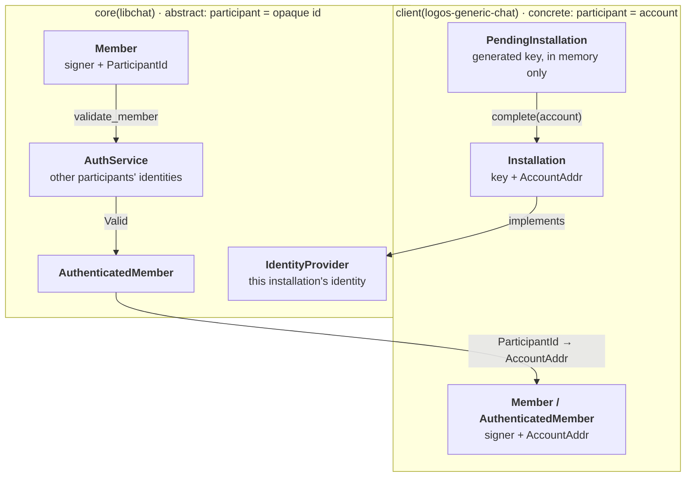

# Identity Model

| Field | Value |
|---|---|
| Status | Proposed |
| Date | 2026-09-17 |

## Context and Problem

Identity passes through several layers, each with its own idea of who someone is:

- **Account system:** accounts, and the installation keys they endorse.
- **Client:** what an account actually is, and which installation this app runs as.
- **Core:** who sent a message and who is in a conversation, without depending on any one account system.
- **MLS:** group leaves, each a signature key plus a credential that MLS carries but never checks.

With no shared model across these layers, each named and typed identity its own way. It was unclear which layer owned a concept, which identifiers had been checked, and what a given name referred to.

Every conversation has to answer two questions: who sent this, and who is in here. Until now one opaque credential answered both. The client decoded it in several places with different trust rules, a roster mixed installations with accounts and deduplicated them by account (so an unauthenticated entry could hide a real one), and the identity types sat in a `shared-traits` crate that only chat used.

This record fixes the vocabulary and where each identity concept lives.

## Decision Drivers

- **Clarity through types.** Each identity concept is its own type, so the compiler keeps a signer, a participant and an authenticated member apart, and anything the core hands out as authenticated can only come from an auth check.
- **Standardize naming.** The same concepts went by several names (delegate, device, local identity, external id), used inconsistently. Each concept now has one name, used the same way in the core, the client and the docs.
- **The core stays generic.** It never learns what an account is; a client decides.
- **No one-app-per-machine assumption.** A person may run several installations on one machine.

## Architecture

| Term | Type | Meaning |
|---|---|---|
| Installation | `PendingInstallation`, `Installation` (client) | This app's own signing key: pending until an account endorses it, then paired with that account. |
| Signer | `Signer` | An installation's public signing key; it identifies exactly one installation. |
| Participant | `ParticipantId` | The user an installation acts for. Opaque bytes to the core. |
| Member | `Member { signer, participant_id }` | A Signer and an associated Participant, as they appear in a conversation. |
| Authenticated member | `AuthenticatedMember` | A Member the `AuthService` vouched for. |



## Decisions

1. **Signer, participant, member; installation, never device.** A signer is the key, a participant is the user, and a member is the two together inside a conversation. "Device" is avoided because it implies one app per machine.

2. **The core says participant; the client says account.** `ParticipantId` is opaque to the core. `logos-generic-chat` makes it an `AccountAddr`, encoded as the account key's bytes, and `crates/generic-chat/src/members.rs` (`account_id` / `account_of`) is the only code that knows that encoding. The account crates are the layer shared with the rest of Logos; the traits below are chat's own, so they live in libchat (`shared-traits` was folded into `core/conversations/src/identity.rs` and `service_traits.rs`).

3. **`IdentityProvider` is our identity; `AuthService` is everyone else's.** Both are services the platform supplies.

    ```rust
    /// What chat needs from whatever holds this installation's own identity.
    pub trait IdentityProvider {
        fn signer(&self) -> SignerRef<'_>;
        fn participant_id(&self) -> ParticipantId;
        fn display_name(&self) -> String;
        fn sign(&self, payload: &[u8]) -> Ed25519Signature;
    }

    /// Checks other participants' identities.
    pub trait AuthService: Debug {
        type Error: Display + Debug;
        fn validate_member(&self, signer: Signer, participant_id: ParticipantId)
            -> Result<AuthResult, Self::Error>;
        fn signers_for_participant(&self, id: &ParticipantId) -> Result<Vec<Signer>, Self::Error>;
    }
    ```

4. **Only an auth check produces an `AuthenticatedMember`.** `Member::require_valid` is its sole constructor. Delivered content carries one; a sender that fails is logged and its content dropped. Verdicts are checked when read and never stored, so a revocation shows on the next read.

5. **Rosters never mix levels.** The core returns committed members that pass auth (`group_members`) and uncommitted invites (`group_pending_members`) separately. The client lists members and pending members per installation, and derives participants as the set of accounts behind authenticated members, so no deduplication rule is needed.

6. **Participants are resolved in the core, through the `AuthService`.** Creating a conversation and adding to a group take participant ids; every one is resolved to its signers before anything is created, and one that does not resolve fails the call with `ChatError::ParticipantResolution`. Lower-level calls take `&[Signer]`.

7. **An installation is validated every time a client starts.** `PendingInstallation` is never persisted. Once the account has endorsed its `endorsement_request()`, `complete(account)` turns it into an `Installation`, the value a client is built from. `build()` asks the client's own `AuthService` and fails with `NotEndorsed` on anything but `Valid`. The check repeats on every start because an endorsement can be revoked after it was stored.

    ```rust
    let pending = PendingInstallation::generate();
    // ... the account endorses `pending.endorsement_request()` ...
    let installation = pending.complete(account_addr);
    let (client, events) = ChatClientBuilder::new(installation)
        .transport(transport)
        .auth(auth) // build() validates the installation with this
        .build()?;
    ```

8. **Causal history names a signer, and only as a hint.** `Frontier::sender` and `DeliveryAck::acked_by` are `Signer`s parsed from the payload's self-asserted id; a malformed id is ignored. They are not bound to the MLS-verified sender, so treat them as display hints.

9. **Identifiers are typed, never strings.** `Signer` and `ParticipantId` are separate types over bytes rather than hex strings or a shared generic id, so passing a `ParticipantId` where a `Signer` is expected is a compile error. Text appears only at the edges (display, registry keys, causal history's wire field, account addresses passed to the client) and is parsed once on the way in.

10. **`ParticipantId` is a concrete type, not an associated type.** An associated type on `AuthService` would hand the client its account type directly, with no decoding. But the type parameter would spread through `Member`, `Content`, `ConvoOutcome`, `PayloadOutcome` and every client function that handles them. The core carries opaque bytes instead, and the client pays one fallible decode per member (decision 2).

## Consequences

The core does not change when a client changes what a participant is, and every roster or sender an application sees has passed the same auth check. The client pays one decode per member, failing closed: a member whose participant id is not an account is dropped.
